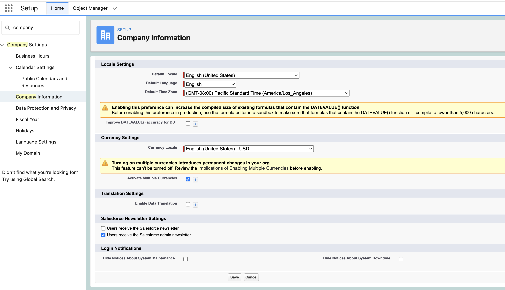

# Notes on Multi Currency in Salesforce 

## Setup

- 
- 
- 
- 

## References
- [Considerations for Enabling Multiple Currencies](https://help.salesforce.com/s/articleView?id=sf.admin_enable_multicurrency_implications.htm&type=5)
- [How to enable Salesforce Multi-currency, and what are its implications?](https://www.sfdcnotes.com/2017/02/22/how-to-enable-salesforce-multi-currency-and-what-are-its-implications) 
